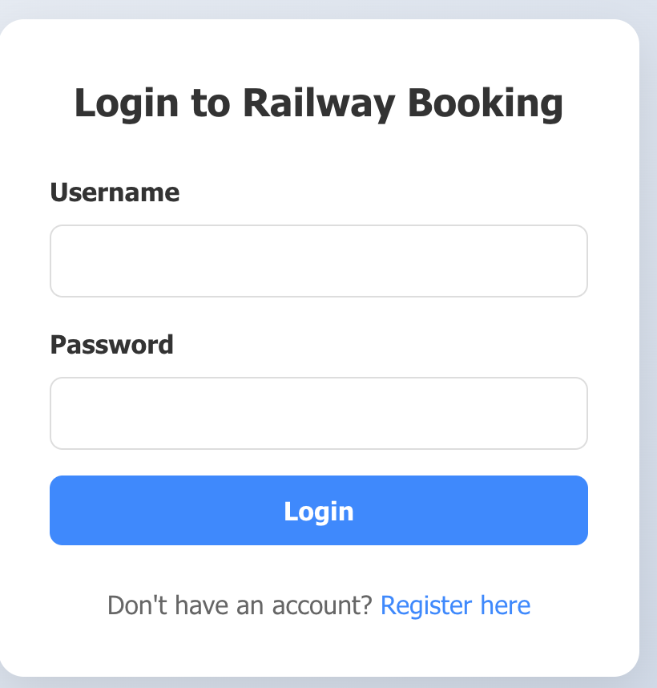
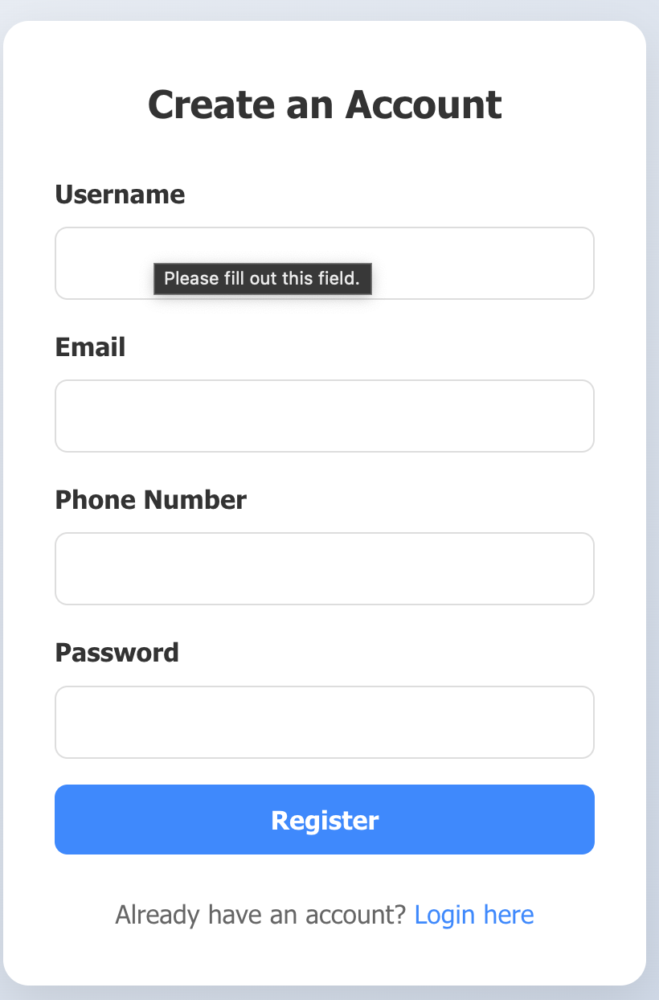
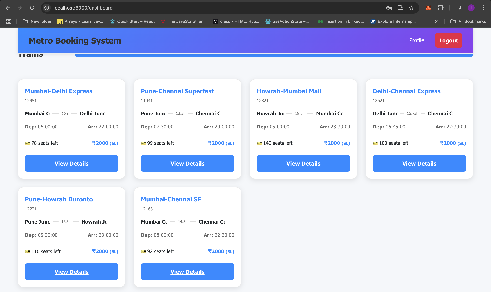
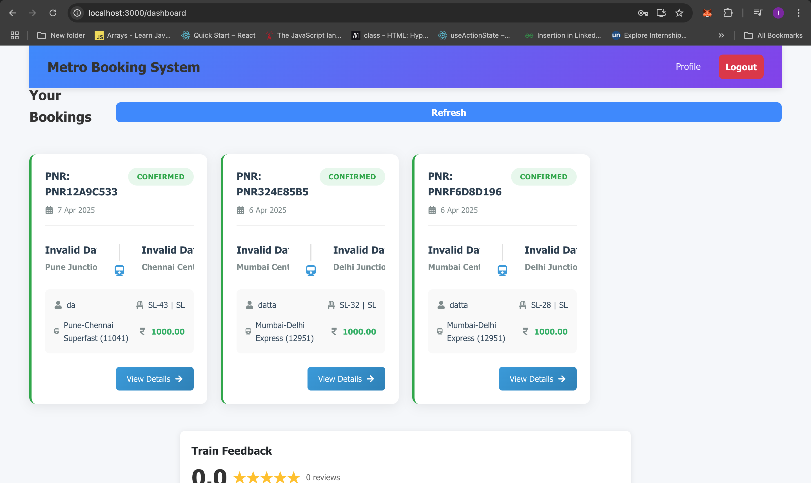
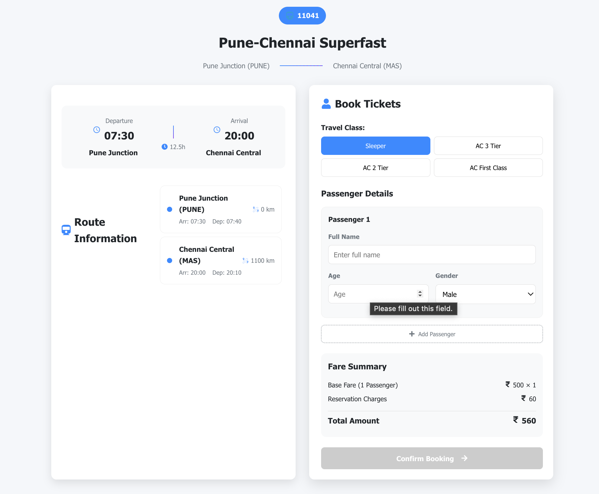
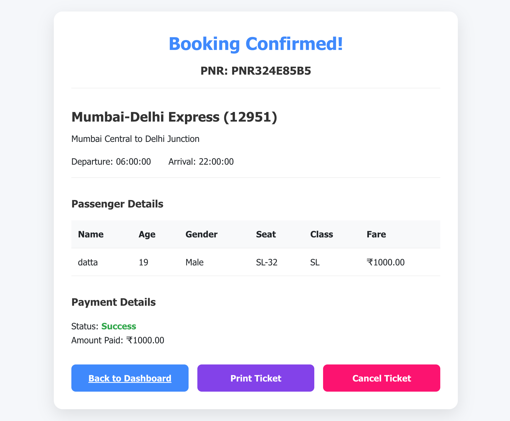

# 🚆 Metro Management System

This is a full-stack Metro/Railway management web application that allows users to book tickets, make payments, view schedules, provide feedback, and more.

---

## 📁 Project Structure

```
root/
├── fron/                 # React frontend (run with `npm start`)
├── back/server.js            # Node.js + Express backend
├── db/                  # Optional: store SQL init scripts here
├── package.json         # Backend dependencies
└── README.md
```

---

## ⚙️ Setup Instructions

### 1. Clone the repository
```bash
git clone https://github.com/Datta2006/Metro-management.git
cd Metro-management
```

---

### 2. 📦 Install Backend Dependencies

```bash
cd back
npm install
```

---

### 3. 🚀 Start Backend Server

```bash
cd back
node server.js
```

---

### 4. 🌐 Start Frontend (React)

In a **new terminal window**:

```bash
cd fron
npm install
npm start
```

---

## 🛢️ MySQL Database Setup

### ✅ Create the Database
```sql
CREATE DATABASE railway_db;
```

---

### 🏗️ Create Tables

```sql
USE railway_db;

CREATE TABLE users (
    id INT PRIMARY KEY AUTO_INCREMENT,
    username VARCHAR(50) NOT NULL UNIQUE,
    password VARCHAR(100) NOT NULL,
    email VARCHAR(100) NOT NULL UNIQUE,
    phone VARCHAR(15),
    role ENUM('admin','user') DEFAULT 'user',
    created_at TIMESTAMP DEFAULT CURRENT_TIMESTAMP
);

CREATE TABLE stations (
    id INT PRIMARY KEY AUTO_INCREMENT,
    name VARCHAR(100) NOT NULL,
    code VARCHAR(10) NOT NULL UNIQUE,
    city VARCHAR(100) NOT NULL,
    state VARCHAR(100) NOT NULL
);

CREATE TABLE trains (
    id INT PRIMARY KEY AUTO_INCREMENT,
    name VARCHAR(100) NOT NULL,
    number VARCHAR(20) NOT NULL UNIQUE,
    source_station_id INT NOT NULL,
    destination_station_id INT NOT NULL,
    total_seats INT NOT NULL,
    available_seats INT NOT NULL,
    departure_time TIME NOT NULL,
    arrival_time TIME NOT NULL,
    journey_duration VARCHAR(20) NOT NULL,
    fare_per_km DECIMAL(10,2) NOT NULL,
    base_fare DECIMAL(10,2) DEFAULT 500.00,
    distance_km INT DEFAULT 500
);

CREATE TABLE train_stops (
    id INT PRIMARY KEY AUTO_INCREMENT,
    train_id INT NOT NULL,
    station_id INT NOT NULL,
    arrival_time TIME NOT NULL,
    departure_time TIME NOT NULL,
    sequence_number INT NOT NULL,
    distance_from_source INT NOT NULL
);

CREATE TABLE bookings (
    id INT PRIMARY KEY AUTO_INCREMENT,
    train_id INT NOT NULL,
    user_id INT NOT NULL,
    pnr_number VARCHAR(15) NOT NULL UNIQUE,
    passenger_name VARCHAR(100) NOT NULL,
    passenger_age INT NOT NULL,
    passenger_gender ENUM('Male','Female','Other') NOT NULL,
    seat_number VARCHAR(10) NOT NULL,
    coach_number VARCHAR(10) NOT NULL,
    class_type ENUM('SL','3A','2A','1A','CC','EC') NOT NULL,
    fare DECIMAL(10,2) NOT NULL,
    booking_status ENUM('Confirmed','Waiting','Cancelled') DEFAULT 'Confirmed',
    booking_date TIMESTAMP DEFAULT CURRENT_TIMESTAMP
);

CREATE TABLE cancellations (
    id INT PRIMARY KEY AUTO_INCREMENT,
    booking_id INT NOT NULL,
    cancellation_reason TEXT,
    refund_amount DECIMAL(10,2) NOT NULL,
    cancellation_date TIMESTAMP DEFAULT CURRENT_TIMESTAMP
);

CREATE TABLE payments (
    id INT PRIMARY KEY AUTO_INCREMENT,
    booking_id VARCHAR(20),
    amount DECIMAL(10,2) NOT NULL,
    payment_method ENUM('Credit Card','Debit Card','Net Banking','UPI','Wallet') NOT NULL,
    transaction_id VARCHAR(100) NOT NULL,
    payment_status ENUM('Pending','Success','Failed') DEFAULT 'Pending',
    payment_date TIMESTAMP DEFAULT CURRENT_TIMESTAMP
);

CREATE TABLE feedback (
    id INT PRIMARY KEY AUTO_INCREMENT,
    user_id INT,
    train_id INT,
    rating INT NOT NULL,
    comments TEXT,
    created_at TIMESTAMP DEFAULT CURRENT_TIMESTAMP
);
```

---

## 🔐 Configure MySQL Credentials

Update your `server.js` file to match your local MySQL credentials:

```js
const connection = mysql.createConnection({
    host: "localhost",
    user: "your_username_here",
    password: "your_password_here",
    database: "railway_db"
});
```

⚠️ Replace `your_username_here` and `your_password_here` with your MySQL user credentials.

---

## 🛠️ Tech Stack

- **Frontend**: React.js
- **Backend**: Node.js + Express.js
- **Database**: MySQL
- **Query Handling**: Raw SQL

---

## 📸 Screenshots / Demo

<p align="center">
  
  
</p>







---

## 👤 Author

Datta ([@Datta2006](https://github.com/Datta2006))

---
